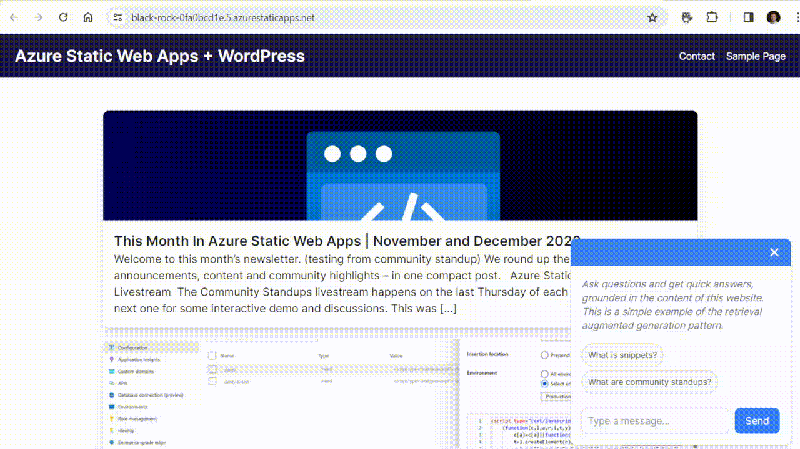

# Add a RAG chatbot to your content-heavy static site

This is a sample project that demonstrates how to add a chatbot to your content-focused static site. The chatbot is grounded in the content of the website by using the retrieval augmentated generation pattern. See the accompanying blog for more information: [https://techcommunity.microsoft.com/t5/apps-on-azure-blog/add-a-context-grounded-ai-chatbot-to-your-azure-static-web-apps/ba-p/4097223](https://techcommunity.microsoft.com/t5/apps-on-azure-blog/add-a-context-grounded-ai-chatbot-to-your-azure-static-web-apps/ba-p/4097223)



This sample builds upon a Next.js static site that demonstrates a content-focused site. See the original blog post to find more information about the Next.js site itself. [Build an Azure Static Web Apps site using WordPress as a headless CMS](https://techcommunity.microsoft.com/t5/apps-on-azure-blog/building-an-azure-static-web-apps-site-using-wordpress-on-app/ba-p/4004955). 

## Getting Started


### Start the Next.js development server

1. Run the development server for the Next.js site:

```bash
cd nextjs-site
npm run dev
```

This should start the Next.js development server on [http://localhost:3000](http://localhost:3000).

### Start the Azure Functions

1. Run the Azure Functions:

```bash
cd api
func start
```

This should start the Azure Functions on [http://localhost:7071](http://localhost:7071).

### Start the Static Web Apps server

1. Run the Static Web Apps server:

```bash
swa start --app-devserver-url http://localhost:3000 --api-devserver-url http://localhost:7071
```

This will start the Static Web Apps server on [http://localhost:4280](http://localhost:4280) and simulate the API routing to the Azure Functions.

## Deploy to Static Web Apps

This sample can be directly deployed to Static Web Apps. It requires that you have a properly configured Azure AI Search, Azure OpenAI resources before you get started. This project has also been configured to use OpenAI APIs directly, so you will need to use an OpenAI API key or adapt the code to use Azure OpenAI for chat completion.

1. Fork this repository.
1. Create a new Static Web Apps resource in the Azure portal using this newly forked repository.
1. Configure the required environment variables for the Azure Functions in the Static Web Apps portal. 
```
  "AI_SEARCH_KEY": "<Enter your Azure AI Search key>",
  "AI_SEARCH_ENDPOINT": "<Enter your Azure AI Search endpoint/URL>",
  "AI_SEARCH_INDEX": "<Enter your Azure AI Search Index>",
  "OPENAI_KEY":"<Enter your OpenAI Key>",
```
